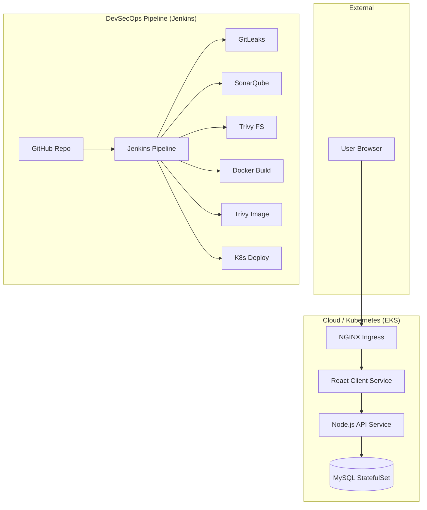

# 🚀 3-Tier DevSecOps Mega Project


A production-ready, cloud-native 3-tier application implementing a full DevSecOps lifecycle. This project demonstrates best practices in infrastructure automation, security integration, and continuous delivery.

---

## 🏛️ Project Architecture

The application follows a classic 3-tier architecture, containerized with Docker and orchestrated by Kubernetes (EKS).



---

## 🛠️ Tech Stack

- **Frontend:** React.js
- **Backend:** Node.js (Express)
- **Database:** MySQL
- **Infrastructure:** AWS EKS, Docker, Docker Compose
- **CI/CD:** Jenkins
- **Security Tools:** 
  - **GitLeaks:** Secret detection
  - **SonarQube:** Static Code Analysis (SAST)
  - **Trivy:** Vulnerability scanning (Filesystem & Images)
- **Notifications:** Slack Integration

---

## 🚀 Getting Started

### Prerequisites

- [Docker](https://docs.docker.com/get-docker/) & [Docker Compose](https://docs.docker.com/compose/install/)
- [Node.js](https://nodejs.org/) (v18+)
- [AWS CLI](https://aws.amazon.com/cli/) & [kubectl](https://kubernetes.io/docs/tasks/tools/)
- [Jenkins](https://www.jenkins.io/download/) (with Docker, Node.js, and K8s plugins)

### Local Development (Docker Compose)

1. Clone the repository:
   ```bash
   git clone https://github.com/bittush8789/3-Tier-DevSecOps-Mega-Project.git
   cd 3-Tier-DevSecOps-Mega-Project
   ```

2. Spin up the environment:
   ```bash
   docker-compose up -d
   ```

3. Access the application:
   - Frontend: `http://localhost:3000`
   - API: `http://localhost:5000`

---

## 🏗️ CI/CD Pipeline Stages

Our Jenkins pipeline (`Jenkinsfile_CICD`) implements the following stages:

1. **Git Checkout:** Pulls latest code from GitHub.
2. **Compilation Check:** Validates syntax for both Frontend and Backend.
3. **GitLeaks Scan:** Ensures no secrets are committed in the codebase.
4. **SonarQube Analysis:** Scans code for bugs, vulnerabilities, and code smells.
5. **Quality Gate:** Fails the build if security thresholds are not met.
6. **Trivy FS Scan:** Scans the project filesystem for vulnerabilities.
7. **Build & Push:** Builds Docker images and pushes them to Docker Hub.
8. **Kubernetes Deployment:** Deploys resources to AWS EKS (`dev` and `prod` namespaces).
9. **Slack Notification:** Sends real-time build status updates.

---

## ☸️ Kubernetes Deployment

The project includes production-grade Kubernetes manifests located in `k8s-prod/` and `k8s-dev/`:

- **StatefulSet:** Persistent storage for MySQL using EBS CSI driver.
- **Services:** LoadBalancer for Backend and ClusterIP for internal communication.
- **Ingress:** NGINX Ingress controller with SSL termination via cert-manager.
- **ConfigMaps & Secrets:** Managed environment configurations.

---

## 🔐 Security Best Practices

- **Principle of Least Privilege:** IAM roles and K8s ServiceAccounts.
- **Image Scanning:** Trivy scans every image before pushing/deploying.
- **SAST:** Continuous code quality monitoring via SonarQube.
- **Secret Management:** Sensitive data is stored in K8s Secrets, not in code.

---

## 👤 Author

**Bittu Sharma**
- [LinkedIn](https://www.linkedin.com/in/bittusharma/)
- [GitHub](https://github.com/bittush8789)

---

## 📄 License

This project is licensed under the MIT License - see the [LICENSE](LICENSE) file for details.
